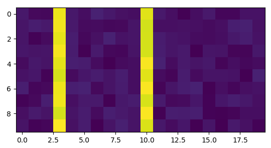

# HW 01

In this homework assignment, you will learn how to do basic calculations using your favorite programming language. I will use **Python >= 3.6** for the demonstration, but you may use any language you like.


## Prob 01 [1-D Data]

From the following Python code, I generated a random data called ``data``

```python
import numpy as np
np.random.seed(123)
data = np.random.random(10)
```

which looks like

```
array([0.93880236, 0.47486626, 0.44612334, 0.71741565, 0.68680956,
       0.96098191, 0.37844385, 0.2884199 , 0.02133488, 0.99026662])
```

(You may copy-and-paste this if you are using different language).

1. Calculate average, median, and standard deviation of ``data``.
2. Calculate average, median, and standard deviation of ``data``, after 1-sigma clipping for 1 time.
3. Calculate average, median, and standard deviation of ``data`` using 1-sigma clipping with more than 1 iterations. At which iteration are these three values stop to change?

*Hint*: You may use the following code if you are using python:

```python
from astropy.stats import sigma_clipped_stats
for i in range(6):
    avg, med, std = sigma_clipped_stats(data, sigma=1, iters=i)
    print(f"N_iter {i}: {avg:.3f}, {med:.3f}, {std:.3f}")
```


## Prob 02 [2-D Data]

Using the following Python code, I generated a fake data called ``data``:

```python
import numpy as np
np.random.seed(123)
data = np.random.random((10, 20))
data[:, [3, 10]] += 10
```

Which looks like:

```
array([[6.96469186e-01, 2.86139335e-01, 2.26851454e-01, 1.05513148e+01,
        7.19468970e-01, 4.23106460e-01, 9.80764198e-01, 6.84829739e-01,
        4.80931901e-01, 3.92117518e-01, 1.03431780e+01, 7.29049707e-01,
        4.38572245e-01, 5.96778966e-02, 3.98044255e-01, 7.37995406e-01,
        1.82491730e-01, 1.75451756e-01, 5.31551374e-01, 5.31827587e-01],
       [6.34400959e-01, 8.49431794e-01, 7.24455325e-01, 1.06110235e+01,
        7.22443383e-01, 3.22958914e-01, 3.61788656e-01, 2.28263231e-01,
        2.93714046e-01, 6.30976124e-01, 1.00921049e+01, 4.33701173e-01,
        4.30862763e-01, 4.93685098e-01, 4.25830290e-01, 3.12261223e-01,
        4.26351307e-01, 8.93389163e-01, 9.44160018e-01, 5.01836676e-01],
       [6.23952952e-01, 1.15618395e-01, 3.17285482e-01, 1.04148262e+01,
        8.66309158e-01, 2.50455365e-01, 4.83034264e-01, 9.85559786e-01,
        5.19485119e-01, 6.12894526e-01, 1.01206287e+01, 8.26340801e-01,
        6.03060128e-01, 5.45068006e-01, 3.42763834e-01, 3.04120789e-01,
        4.17022211e-01, 6.81300766e-01, 8.75456842e-01, 5.10422337e-01],
       [6.69313783e-01, 5.85936553e-01, 6.24903502e-01, 1.06746891e+01,
        8.42342438e-01, 8.31949883e-02, 7.63682841e-01, 2.43666375e-01,
        1.94222961e-01, 5.72456957e-01, 1.00957125e+01, 8.85326826e-01,
        6.27248972e-01, 7.23416358e-01, 1.61292067e-02, 5.94431879e-01,
        5.56785192e-01, 1.58959644e-01, 1.53070515e-01, 6.95529529e-01],
       [3.18766426e-01, 6.91970296e-01, 5.54383250e-01, 1.03889506e+01,
        9.25132490e-01, 8.41669997e-01, 3.57397567e-01, 4.35914638e-02,
        3.04768073e-01, 3.98185682e-01, 1.07049588e+01, 9.95358482e-01,
        3.55914866e-01, 7.62547814e-01, 5.93176917e-01, 6.91701799e-01,
        1.51127452e-01, 3.98876293e-01, 2.40855898e-01, 3.43456014e-01],
       [5.13128154e-01, 6.66624550e-01, 1.05908485e-01, 1.01308950e+01,
        3.21980606e-01, 6.61564337e-01, 8.46506225e-01, 5.53257345e-01,
        8.54452488e-01, 3.84837811e-01, 1.03167879e+01, 3.54264676e-01,
        1.71081829e-01, 8.29112635e-01, 3.38670846e-01, 5.52370075e-01,
        5.78551468e-01, 5.21533059e-01, 2.68806457e-03, 9.88345419e-01],
       [9.05341576e-01, 2.07635861e-01, 2.92489413e-01, 1.05200102e+01,
        9.01911373e-01, 9.83630885e-01, 2.57542064e-01, 5.64359043e-01,
        8.06968684e-01, 3.94370054e-01, 1.07310730e+01, 1.61069014e-01,
        6.00698568e-01, 8.65864458e-01, 9.83521609e-01, 7.93657904e-02,
        4.28347275e-01, 2.04542860e-01, 4.50636491e-01, 5.47763573e-01],
       [9.33267104e-02, 2.96860775e-01, 9.27584240e-01, 1.05690037e+01,
        4.57411998e-01, 7.53525991e-01, 7.41862152e-01, 4.85790328e-02,
        7.08697395e-01, 8.39243348e-01, 1.01659379e+01, 7.80997938e-01,
        2.86536617e-01, 3.06469753e-01, 6.65261465e-01, 1.11392172e-01,
        6.64872449e-01, 8.87856793e-01, 6.96311268e-01, 4.40327877e-01],
       [4.38214384e-01, 7.65096095e-01, 5.65642001e-01, 1.00849042e+01,
        5.82671088e-01, 8.14843703e-01, 3.37066383e-01, 9.27576580e-01,
        7.50717000e-01, 5.74063825e-01, 1.07516440e+01, 7.91489607e-02,
        8.59389076e-01, 8.21504113e-01, 9.09871660e-01, 1.28631198e-01,
        8.17800871e-02, 1.38415573e-01, 3.99378710e-01, 4.24306861e-01],
       [5.62218379e-01, 1.22243550e-01, 2.01399501e-01, 1.08116443e+01,
        4.67987574e-01, 8.07938209e-01, 7.42637854e-03, 5.51592726e-01,
        9.31932148e-01, 5.82175459e-01, 1.02060957e+01, 7.17757562e-01,
        3.78985850e-01, 6.68383947e-01, 2.93197229e-02, 6.35900359e-01,
        3.21979349e-02, 7.44780655e-01, 4.72913002e-01, 1.21754355e-01]])
```

This mimics width of 20 pixels and height of 10 pixels of spectrum, and two emission lines:



1. Do the median combine along the y-axis (in numpy, axis 0).
2. Do the median combine along the y-axis (in numpy, axis 0), with 1-sigma 3-iterations clipping.

*Hint*: If you are using Python, you may use the following code:

```python
from matplotlib import pyplot as plt
from astropy.stats import sigma_clipped_stats
for i in [0, 3]:
    avg, med, std = sigma_clipped_stats(data, sigma=1, iters=i, axis=0)
    plt.plot(med, label=f"Niter = {i}", ls=':', marker='.')
plt.title("Median combine")
plt.grid(ls=':')
plt.legend()
```

